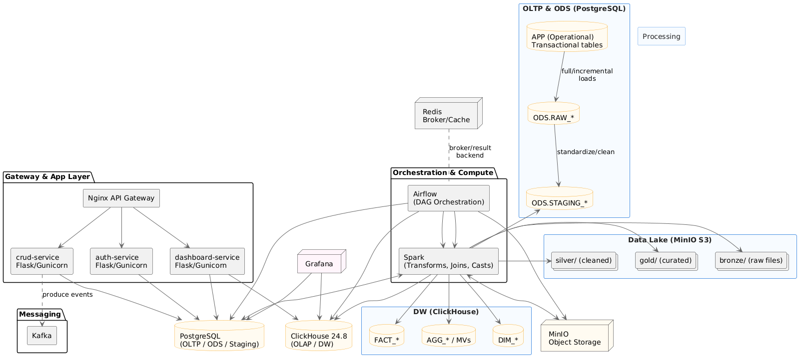

This project was designed to implement a real-time data pipeline for streaming data from a transactional PostgreSQL database to an analytical data warehouse in ClickHouse. Due to time constraints and a focus on proof of concept, the implementation scope was narrowed to a sample use case on the Customer table, covering only Insert and Update operations with a few basic business validation rules. It should be noted that the original problem statement required coverage of all base and related tables in the Northwind database, with real-time reflection of all changes—including inserts, deletions, updates, as well as structural schema changes. The architectural approach and framework implemented—including CDC via Debezium, event streaming via Kafka, stream processing with Spark, and loading into ClickHouse—has been fully designed and tested, and is fully extensible to cover all required tables and scenarios. Given adequate time, this prototype can be developed into a comprehensive, production-ready solution.

******************************************************************************************
# Data Engineering Docker Stack

A fully containerized **Data Engineering Platform** built with Docker Compose.  

### It provides an end-to-end analytics/streaming pipeline:
- ingestion (CDC), messaging, processing (ETL)
- data warehousing
- orchestration
- monitoring

Repository:
- GitHub: https://github.com/A-Azarmi/dataStack
- Docker Hub: https://hub.docker.com/r/amirazarmi/data-stack
---
## Stack Overview

| Layer | Component | Description |
|-------|------------|-------------|
| **DataBase** | PostgreSQL | Primary OLTP database (Northwind) |
| **DataWarehouse**  | ClickHouse | Analytical OLAP database (DW) |
| **Storage** | MinIO | S3-compatible object storage (future use) |
| **Messaging** | Apache Kafka | Event streaming backbone |
| **CDC** | Debezium (Kafka Connect) | Change Data Capture from PostgreSQL into Kafka topics |
| **Orchestration** | Apache Airflow | Workflow scheduling and orchestration (baseline included) |
| **Computation** | Apache Spark | Real-time ETL with business rules |
| **Visualization** | Grafana | Dashboards and metrics visualization |
| **App Layer** | Flask app microservices | Placeholder for API validation & access layer |
| **Gateway** | Nginx | API reverse proxy (optional / future) |

---

## Architecture



---

## Project Structure

```text
.
├── airflow
│   ├── dags
│   ├── logs
│   └── plugins
├── clickhouse
│   └── init
│       ├── 01_order_wide.sql
│       └── 02_dim_customers.sql
├── connectors
│   └── debezium-northwind.json
├── docker-compose.yml
├── flask_app
├── grafana
│   └── provisioning
├── minio
│   └── data
├── postgres
│   └── init
│       ├── 01_northwind.sql
│       └── 02_replication_user.sql
├── spark
│   ├── app
│   │   └── northwind_streaming.py
│   └── Dockerfile
└── spark-app

```
## Tests

CDC (PostgreSQL → Debezium → Kafka)
Connector config

Connector JSON:

connectors/debezium-northwind.json

## Check connector status

```text

curl -s http://localhost:8083/connectors | jq

curl -s http://localhost:8083/connectors/northwind-cdc-connector/status | jq
```

## Check Kafka topics (inside docker network)
```text
docker compose exec kafka bash -lc \
"kafka-topics --bootstrap-server kafka:9092 --list | grep -E '^northwind\.public\.' | sort"
```

## Check tables
```text
docker compose exec clickhouse clickhouse-client -q "SHOW DATABASES;"
docker compose exec clickhouse clickhouse-client -q "SHOW TABLES FROM northwind_dw;"
```

# Spark RealTime ETL

## Main Spark streaming job
```text

docker compose exec spark bash -lc \
"spark-submit \
 --conf spark.jars.ivy=/tmp/.ivy2 \
 --packages org.apache.spark:spark-sql-kafka-0-10_2.12:3.5.3 \
 /opt/spark-app/northwind_streaming.py"
```

Business Rule: Validate-before-write using Lookup on PostgreSQL
For every micro-batch read from Kafka topic northwind.public.customers:
- Spark parses Debezium messages and extracts customer_id values.
- Spark performs a lookup query on PostgreSQL to verify that each customer_id exists in public.customers.
- Records with customer_id NOT found in PostgreSQL are dropped.
- Only validated records are written to ClickHouse table northwind_dw.dim_customers (DW).

## This rule guarantees:

- The rule always runs (it is inside foreachBatch before any write).
- Lookup happens before DW writes.
- ClickHouse is the authoritative DW output.

# Test Plan (Executable Scenarios)


## Reset table for clean testing:

```text
docker compose exec clickhouse clickhouse-client -q "TRUNCATE TABLE northwind_dw.dim_customers;"
docker compose exec clickhouse clickhouse-client -q "SELECT count() FROM northwind_dw.dim_customers;"
```

## (Optional) Reset Spark checkpoint for clean reprocessing:

```text
docker compose exec spark bash -lc "rm -rf /tmp/spark-checkpoints/dim_customers || true"
```

## Valid Customer → Must be written to ClickHouse (DW)
Goal: Prove lookup passes and write occurs for a real customer existing in PostgreSQL.

```text
Get a real customer_id:

docker compose exec postgres psql -U app_user -d northwind -t -c \
"SELECT customer_id FROM public.customers ORDER BY customer_id LIMIT 1;"
```

## Update that customer to generate a CDC event:

```text
docker compose exec postgres psql -U app_user -d northwind -c \
"UPDATE public.customers SET company_name = company_name || ' TEST_VALID' WHERE customer_id = 'ALFKI';"
```

## Confirm DW output:

```text
docker compose exec clickhouse clickhouse-client -q \
"SELECT count() FROM northwind_dw.dim_customers;"

docker compose exec clickhouse clickhouse-client -q \
"SELECT customer_id, company_name, op, src_ts
 FROM northwind_dw.dim_customers
 ORDER BY src_ts DESC
 LIMIT 5;"
```

## Invalid Customer → Must be dropped BEFORE ClickHouse write

Goal: Prove lookup fails and record is not written to DW.
Inject an invalid Debezium-like message into Kafka (customer_id does not exist in Postgres):

```text
docker compose exec kafka bash -lc '
cat <<EOF | kafka-console-producer --bootstrap-server kafka:9092 --topic northwind.public.customers
{"after":{"customer_id":"ZZZ_NOT_EXISTS","company_name":"Fake Co"},"op":"c"}
EOF'

Confirm it was NOT written to ClickHouse:

docker compose exec clickhouse clickhouse-client -q \
"SELECT count() FROM northwind_dw.dim_customers WHERE customer_id='ZZZ_NOT_EXISTS';"
```

## Mixed Valid + Invalid → Only Valid written to DW

Goal: Prove business rule filters within the same run.

```text
Reset table:

docker compose exec clickhouse clickhouse-client -q "TRUNCATE TABLE northwind_dw.dim_customers;"
```

```text
Validate:

docker compose exec clickhouse clickhouse-client -q \
"SELECT count() FROM northwind_dw.dim_customers;"

docker compose exec clickhouse clickhouse-client -q \
"SELECT count() FROM northwind_dw.dim_customers WHERE customer_id='ZZZ_NOT_EXISTS';"
```

## Check status:
```text

curl -s http://localhost:8083/connectors/northwind-cdc-connector/status | jq
```


